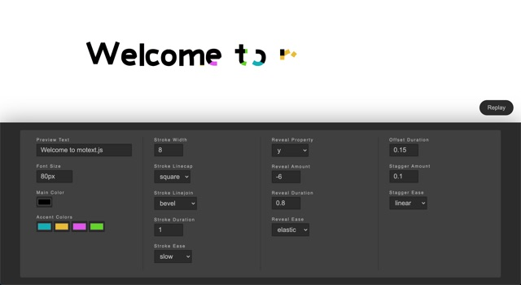

motext.js is a simple to use Javascript SVG text animation library. The quickest way to see exactly what you can do with it is to [try out the motext.js editor](https://themarkappleby.github.io/motext/).

[](https://themarkappleby.github.io/motext/)

## Quick Overview

```html
<!-- Add an element with some text -->
<h1 id="target">Hello World</h1>

<!-- Load GreenSock (this is a dependancy of motext) -->
<script src="https://cdnjs.cloudflare.com/ajax/libs/gsap/3.3.4/gsap.min.js"></script>

<!-- Load motext -->
<script src="https://unpkg.com/motext@1.3.1/dist/motext.js"></script>

<script type="text/javascript">
  // Load the motext font
  motext.loadFont('https://unpkg.com/motext@1.3.1/dist/fonts/motext.svg').then(() => {
    // Initialize and play the motext animation
    // Optionally pass in some parameters
    motext.init('#target', {
      color: 'blue',
      revealProperty: 'scale'
    }).play()
  })
</script>
```

## Getting Started

Though you *can* import motext via a CDN like in the example above, you can alternatively add motext as a dependancy to your project via `npm install motext --save` or `yarn add motext`. You can then import motext with `import motext from 'motext'` in your Javascript.

## Methods

### loadFont(path)

**path**: A string path to a motext SVG font. At the moment there is only one font, but in theory more fonts could be added in the future. This method returns a promise that will resolve once the font has been loaded and injected into the DOM.

### init(element, options | optional)

The init method takes two parameters with the second one being optional.

**element**: Either a string in the form of a CSS selector or an actual DOM element(s)/NodeList. For example, the following would all be valid: `'.target'`, `'#target'`, `document.getElementById('#target')`, or `document.querySelectorAll('#target')`.

**options**: An object specifying the parameters that motext should apply to the text animation. See below for more details or [try out the motext.js editor](https://themarkappleby.github.io/motext/) to experiment with them in real-time.

The init method returns an instance of motext with the following structure:
```
{
  el: [String | HTMLElement | Nodelist] The element you original passed into the init method.
  collection: [Array] The above element(s) separated into a JS array.
  options: [Object] The options object you originally passed into the init method.
  timelines: [Array] An array of GreenSock timelines (one for each item in the collection).
  play: [Function] A method which plays all timelines in the timelines array when invoked. This method returns a promise that resolves once the motext animation has completed.
}
```

## Options

### color
The main text color. This is the color that the text will display in once the animation has completed.
Default: `#000000'`

### colors
An array of colors to use during the motext animation. These colors will be applied in the order specified. Motext will loop back to the color in the first position of this array once it reaches the end.
Default: `['#0dafb7', '#eabc36', '#e154ed', '#62d628']`

### revealProperty
The CSS property to effect when animating in each character.
Default: `'y'

### revealAmount
The "from" value to use when animating in each character.
Default: `-6`

### revealDuration
The speed at which each character will animate in.
Default: `0.8`

### revealEase
The easing to apply when animating in each character. See the [GreenSock easing documentation](https://greensock.com/docs/v3/Eases) for the full list of supported easing methods.
Default: `'elastic'`

### strokeWidth
The stroke width to use for the font.
Default: `8`

### strokeLinecap
The SVG linecap to use for the font. Supported values are: `butt`, `round`, or `square`.
Default: `'square'`

### strokeLinejoin
The SVG linejoin to use for the font. Supported values are: `arcs`, `bevel`, `miter`, `miter-clip`, or `round`.
Default: `'bevel'`

### strokeDuration
The amount of time it takes for a single character stroke to animate.
Default: `1`

### strokeEase
The easing to apply when animating each character stroke. See the [GreenSock easing documentation](https://greensock.com/docs/v3/Eases) for the full list of supported easing methods.
Default: `'slow'`

### offsetDuration
The amount of time between when the colored text animated begins vs when the main text color animation begins.
Default: `0.15`

### staggerAmount
The amount of time between when each character is animated in sequence.
Default: `0.1`

### staggerEase
The easing to apply when sequencing the character animations. See the [GreenSock easing documentation](https://greensock.com/docs/v3/Eases) for the full list of supported easing methods.
Default: `'none'`

## Changing the Font Size and Spacing

The motext font size corresponds with whatever font size you apply to your target element via CSS. Motext also accounts for media queries with regards to font-size with a built-in window resize listener. You can also change various font spacing properties via CSS (default values are listed below):

```
.motext-word {
  margin-right: 0.4em; /* controls space between words */
  margin-bottom: 0.4em; /* controls line-height */
}

.motext-letter {
  margin-right: 0.04em; /* controls letter-spacing */
}

.motext-letter--descend {
  margin-bottom: -0.22em; /* controls how far character with descenders (like j, p and q) drop */
}
```

## Changing the Font

At the moment, motext only comes with a single font, which can be found in `/dist/fonts/motext.svg`. You can edit this SVG directly to change the look of the typeface. There is also a [Sketch](https://www.sketch.com/) file that can be found in `/src/fonts/motext.sketch` which you can use to alter the typeface. If you do create a new typeface, please consider adding it back to this project with a pull request.

The motext typeface supports a subset of characters. These include: `A-Z a-z 0-9 ! ? & . , " '`. If your text contains a character not found in that list, motext will omitted the character(s) and display a warning in the console. Support for additional characters can be added by altering motext.svg as noted above.

Unfortunately you cannot load any typeface into motext. The reason for this is that motext works on the assumption that each character is made up of one ore more strokes rather than filled shapes which traditional typefaces use.
